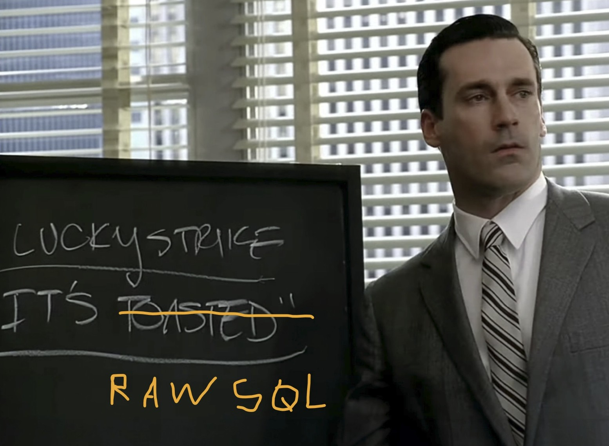

## Reinventing the wheel: A mini-framework for abstracting features to their core essence in data flow and database architecture

Task: Create your very own front-end framework, which allows you to describe user interfaces with JavaScript.

Plan: Aside from doing a JS library of prebuilt components which together look kind of like a framework, will try to build a more Django-like mini web framework experience, where features and processes could be chipped down to their core essence from databse and data flow POV. Trying to max out raw SQL queries and have a heavy DB and as light of a backend and frontend as possible - so that procedural code is just a language-agnostic wrapper around the DB operations. 

  

### Instructions for framework:
- Instructions can be found in framework/README.md
- Instructions and the framework are deliberately Django-like: We enforce clear IoC, but we do not limit the user from trying to do whatever they like if they have already decided to use such framework for whatever reason.
- For example, external tools (like Postgres) are not tied to the framework itself, so it is not covered in detail - std setup first, then generating creds and placing them to .env in /example for the pool to work with db etc.

### Also, mimicking a local distribution a bit npm-like, so tools are actually imported from framework and not referenced directly from framework directory:

- example dir which shows usage
- framwork dir has:
    - framework/core_backend
    - framework/core_frontend
    - framework/core_package_json - the file has a npm run build command which mimics pulling the tool from npm, but if needed files would not be copied over already, then it could copy files from correct dirs and place them inside the correct dirs in example.

In a real-world scenario, would publish this framework to NPM. For this demo:

1. We keep our front-end framework code in `framework/core/`.
2. We run `npm start` with a stringed script to copy those files into `example/frontend/lib/`.
3. The example project imports from `./lib`, and our Express server then serves those files to the browser.

### Example project build POV:

- While tools in framework are built in this weird way as required by school with various restrictions, in the example dir we have to assume that an engineer would use more common practices in the JS realm.
- Thus, the limited procedural code need is actually beneficial here, because we have to juggle less restrictions and syncing.

### Dataset citation for the Limit example:

https://grouplens.org/datasets/movielens/latest/

> F. Maxwell Harper and Joseph A. Konstan. 2015. The MovieLens Datasets: History and Context. ACM Transactions on Interactive Intelligent Systems (TiiS) 5, 4: 19:1–19:19. https://doi.org/10.1145/2827872

